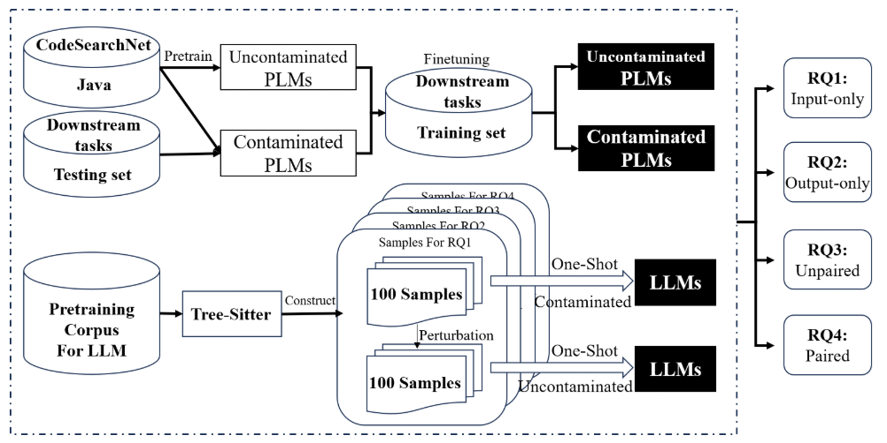

# Contamination Means Overestimation? A Comprehensive Empirical Study in Code Intelligence

## Experimental Procedure


## Prompt
Here is the prompt we used for large language model inference, along with a one-shot example.

Code Translation:
```
Please translate the following Java function into equivalent C# code. End your answer with 'END OF CASE'.
Java:
private void injectBundleContext(BundleContext bundleContext) {
    this.bundleContext = bundleContext;
    this.resourceLoader = new OsgiBundleResourceLoader(bundleContext.getBundle());
}         
C#:
private void InjectBundleContext(BundleContext bundleContext) {
    this.bundleContext = bundleContext;
    this.resourceLoader = new OsgiBundleResourceLoader(bundleContext.getBundle());
}
END OF CASE
Java:
{entry['Java_function']}
C#:
```

Code Summarization:
```
Please summarize the following Java function. End your answer with 'END OF CASE'.
Function:
private void injectBundleContext(BundleContext bundleContext) {
    this.bundleContext = bundleContext; this.resourceLoader = new OsgiBundleResourceLoader(bundleContext.getBundle());
}
Summary:
This Java function injects a `BundleContext` object, stores it, and initializes a `ResourceLoader` with the associated bundle.
END OF CASE
Function:
{entry['Function']}
Summary:
```

Code Generation:
```
Please implement the following Java function. End your answer with 'END OF CASE'.
Instruction:
Write a Java method that sets a `name` field to the provided parameter value.
Function:
public void setName(String name) {
    this.name = name;
}
END OF CASE
Instruction:
{entry['Instruction']}
Function:

```

## Complete Result

Please refer to the [result](./result.md) for the complete experimental results

## Pretrained Model

#### RoBERTa-base

#### GPT2-small


## Large Language Model

### Data construction
The Java and C# data used in StarCoder's pretraining can be obtained from [bigcode/the-stack](https://huggingface.co/datasets/bigcode/the-stack), while the Java and C# data used in LLaMA's pretraining can be accessed via [bigquery](https://console.cloud.google.com/bigquery?ws=!1m4!1m3!3m2!1sbigquery-public-data!2sgithub_repos).


Collect a large number of Java function snippets, then manually select 100 samples.
```shell
python extract-java.py
```
Collect a large number of matched Java–C# function pairs, perform an initial filtering using BLEU scores, and then manually select 100 pairs.
```shell
python extract-paired.py
python cal-bleu.py
```
Collect a large number of paired NL-code examples, and then manually select those that are suitable for code generation tasks.
```shell
python extravt-paired.py
```